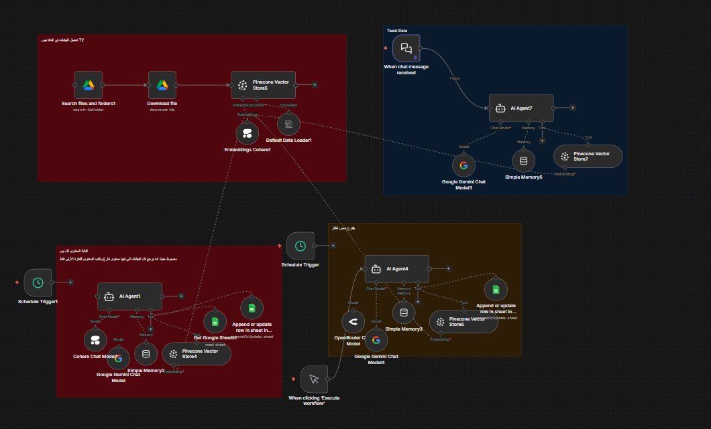
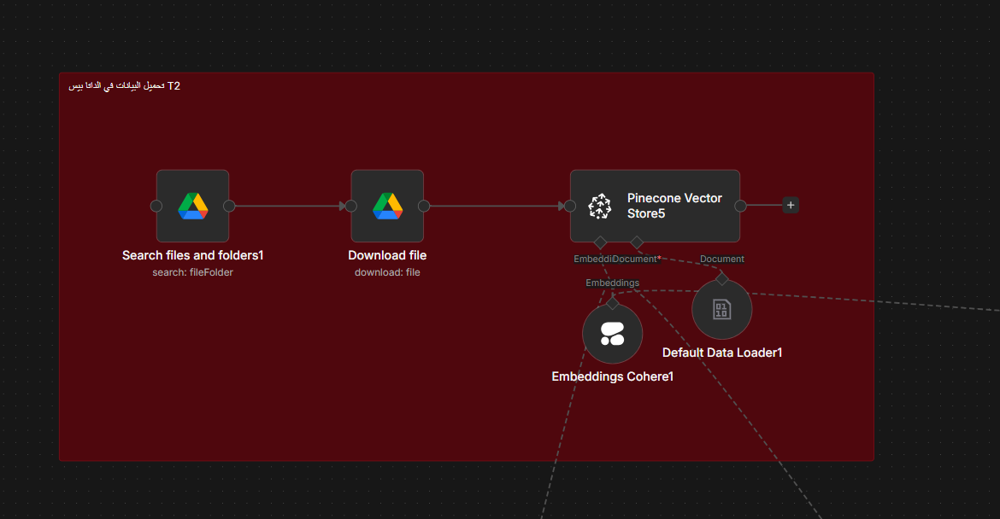
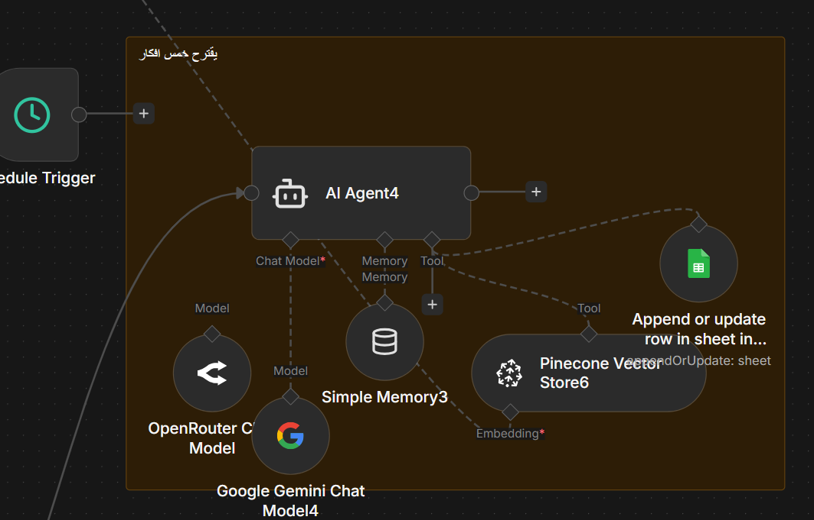
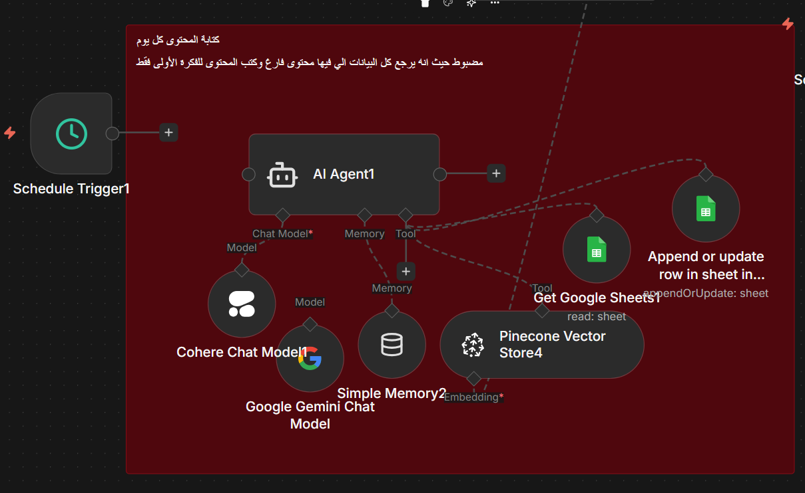
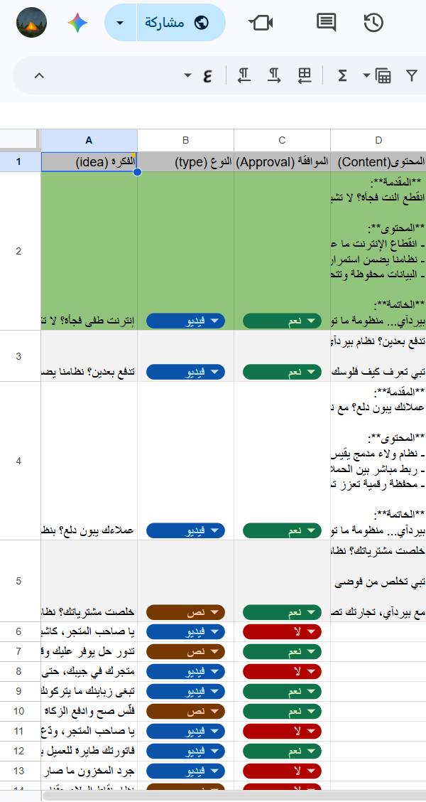

# 💡 Marketing Ideation & Content Generator Agent (n8n + AI)

An intelligent AI-powered workflow built with **n8n** that automatically generates marketing ideas, content variations, and creative directions using Large Language Models (LLMs).

The workflow helps marketing teams accelerate content creation by producing structured outputs ready for review and publishing.

---

## 🚀 Overview

This project automates the creative ideation process by:

- Generating marketing ideas from a given topic
- Creating multiple content variations
- Classifying content by audience and tone
- Organizing results for team collaboration
- Saving outputs directly into Google Sheets

---

## 📸 Workflow Preview

### Main Workflow



---

## ✨ Key Features

- 🤖 AI-powered ideation engine
- 📝 Multi-format content generation
- 🎯 Audience & tone classification
- 📊 Automatic Google Sheets integration
- 👥 Human-in-the-loop review option
- ⚡ Fully automated workflow execution

---

## 🧠 Workflow Logic

```text
Loading Data 
      ↓
AI Agent (Idea Generation)
      ↓
Content Variations
      ↓
Classification & Categorization
      ↓
Google Sheets Storage
      ↓
Slack / Email Notification (Optional)
```

---

## 🧩 Workflow Breakdown

### 1️⃣ Data Input / Loading Stage

The workflow starts by receiving input data or a trigger event.



---

### 2️⃣ AI Agent - Idea Generation

The AI Agent generates marketing ideas based on the input topic.



---

### 3️⃣ AI Agent - Enhanced Processing

A second AI processing stage refines and expands the generated ideas.



---

### 4️⃣ Google Sheets Integration

All generated content is structured and stored in Google Sheets for collaboration and review.



---

### 5️⃣ Workflow Overview (Final View)

Complete visualization of the full automation pipeline.


---

## 🛠 Tech Stack

- n8n
- Gemini
- Google Sheets API
- Pinecone
- Cohere
- LLM Agents
- Prompt Engineering

---

## 📂 Project Structure

```text
.
.
├── images/
│   ├── Workflow.png
│   ├── Loading Data.png
│   ├── AI agent.png
│   ├── AI agent2.png
│   ├── Googelsh.png
│
├── workflow.json
└── README.md
```

---

## ⚙️ Setup

1. Import `workflow.json` into n8n
2. Configure Gemini credentials
3. Configure Pinecone credentials
4. Configure Cohere credentials
5. Configure Google Sheets credentials
6. Run a test execution
7. Activate the workflow

---

## 👤 Author

**Omar Sahhari**

Data • AI & Automation Systems
